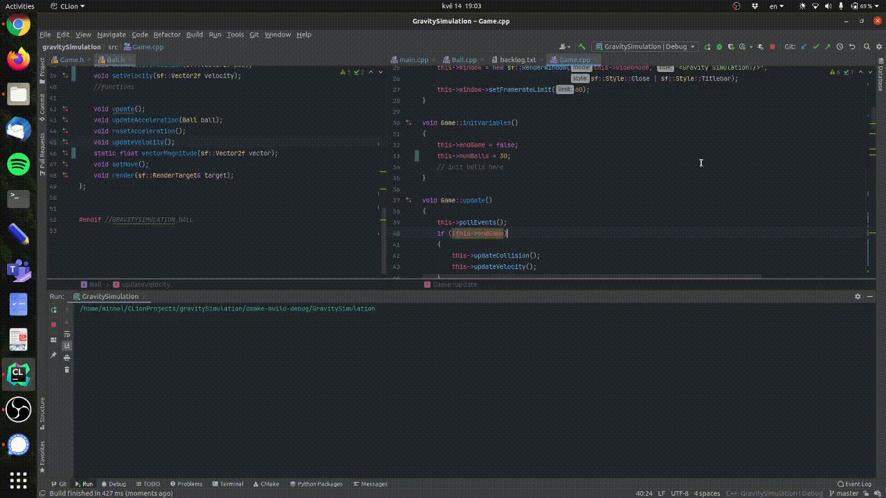

# GravitySimulation
This is a little project I am working on as a part of learning C++ and SFML. The idea is to have a simple simulation of gravity. In backlog.txt I keep info about which part I am currently working on.

